# AI Landing Zone — Portal Deployment Guide

## Overview

The Portal-based AI Landing Zone deploys a secure, enterprise-ready AI/ML infrastructure on Azure through a guided wizard experience in the Azure Portal. It uses ARM linked templates backed by [Azure Verified Modules (AVM)](https://aka.ms/AVM) and deploys resources including Azure AI Foundry, networking, security, monitoring, and application services.

**Deploy to Azure:**

[](https://portal.azure.com/#blade/Microsoft_Azure_CreateUIDef/CustomDeploymentBlade/uri/https%3A%2F%2Fraw.githubusercontent.com%2FAzure%2FAI-Landing-Zones%2Frefs%2Fheads%2Fportal%2Fportal%2Ftemplate.json/uiFormDefinitionUri/https%3A%2F%2Fraw.githubusercontent.com%2FAzure%2FAI-Landing-Zones%2Frefs%2Fheads%2Fportal%2Fportal%2Fform.json)

---

## Prerequisites

- An Azure subscription with **Contributor** role (or **Owner** if enabling Microsoft Defender)
- A resource group in a [supported region](https://learn.microsoft.com/en-us/azure/ai-services/openai/concepts/models#model-summary-table-and-region-availability)
- If using Platform Landing Zone mode: existing Private DNS Zones for the services being deployed
- Sufficient quota for the selected VM sizes and AI model deployments

---

## Wizard Steps

The deployment wizard consists of **7 tabs**, described in detail below.

---

## Step 1: Basic Configuration

| Option | Default | Description |
|--------|---------|-------------|
| **Resource Group / Location** | — | Target resource group and Azure region for all resources |
| **Base Name** | `ailz` | 2–12 character prefix (lowercase letters + numbers only) used to name all deployed resources |
| **Platform Landing Zone Integration** | No | Whether you're deploying into an existing enterprise platform landing zone |
| **Enable Defender for AI** | No | Enables Microsoft Defender for AI and Storage (with malware scanning and sensitive data discovery) at subscription level |
| **Enable Defender for Key Vault** | No | Enables Defender for Key Vault at subscription level |
| **Enable Telemetry** | Yes | Sends anonymous usage telemetry to Microsoft |

### Base Name

The base name seeds the naming convention for all resources. For example, with `baseName = ailz`:

| Resource | Name |
|----------|------|
| Virtual Network | `vnet-ailz` |
| Key Vault | `kv-ailz` |
| Storage Account | `stailz` |
| Build VM | `vm-ailz-bld` |
| Jump VM | `vm-ailz-jmp` |
| Container App | `ca-ailz-orchestrator` |
| Log Analytics | `law-ailz` |
| App Insights | `appi-ailz` |
| Container Registry | `acrailz` |
| Cosmos DB | `db-ailz` |

### Platform Landing Zone Integration

This is the **most significant architectural toggle** in the deployment. It controls whether the landing zone is self-contained or integrates with centrally managed enterprise infrastructure.

**When set to "Yes":**

| What happens | Why |
|--------------|-----|
| Azure Firewall is **hidden/not deployed** | Egress filtering is managed by the platform team |
| Application Gateway is **hidden/not deployed** | Ingress is managed centrally |
| API Management is **hidden/not deployed** | AI Gateway is managed centrally |
| Bastion Host is **not deployed** | Secure access is provided by the platform |
| Private DNS Zone creation is **skipped** | You must select existing DNS zones for each service |
| WAF Policy is **not deployed** | Managed at platform level |
| Associated Public IPs and NSGs are **not deployed** | Not needed without the above resources |

**When set to "No" (default):**
- All networking, security, and DNS resources are deployed as a self-contained environment
- A Bastion Host is automatically deployed for secure VM access
- Private DNS Zones are created and linked to the VNet

### Defender Options

| Option | Visibility | What it enables |
|--------|-----------|-----------------|
| **Defender for AI** | Always visible | Subscription-level Defender for AI + Storage (malware scanning, sensitive data discovery) |
| **Defender for Key Vault** | Only if Defender for AI = Yes | Subscription-level threat detection for Key Vault operations |

> **Note:** Defender enablement is a subscription-scoped operation and requires Owner or Security Admin permissions.

---

## Step 2: AI Services Configuration

| Option | Default | Impact When Disabled |
|--------|---------|---------------------|
| **Deploy AI Search** | Yes | No Azure AI Search service; AI Foundry won't have a search connection |
| **Deploy Bing Grounding** | Yes | No Bing Search grounding capability for AI agents |
| **Deploy Cosmos DB** | Yes | No Cosmos DB; no private endpoint or role assignments for database access |
| **Deploy Key Vault** | Yes | No Key Vault; Defender for Key Vault becomes irrelevant |
| **Deploy Storage Account** | Yes | No Storage Account; AI Foundry won't have a storage connection |

> **Important:** Azure AI Foundry (the core AI hub/project) is **always deployed** — it is not optional. These services complement it. The deployment automatically provisions two AI models:
>
> | Model | Version | SKU | Capacity |
> |-------|---------|-----|----------|
> | gpt-5-mini | 2025-08-07 | GlobalStandard | 10 |
> | text-embedding-3-large | v1 | Standard | 1 |

### How AI Services connect to AI Foundry

When enabled, each service is automatically connected to the AI Foundry hub:
- **AI Search** → Foundry connection for RAG (Retrieval-Augmented Generation) scenarios
- **Storage Account** → Foundry connection for data storage and file uploads
- **App Insights** → Foundry connection for telemetry and tracing

---

## Step 3: Application Services Configuration

| Option | Default | Visibility | Description |
|--------|---------|-----------|-------------|
| **Deploy Azure Container Registry** | Yes | Always | Premium-tier ACR for storing container images |
| **Deploy Container Apps Environment** | Yes | Always | Managed environment for running containerized workloads |
| **Deploy Container App (Orchestrator)** | Yes | Only if Container Apps Env = Yes | Deploys a placeholder orchestrator container app |
| **Deploy App Configuration** | Yes | Always | Centralized configuration store populated with service endpoints |
| **Deploy Azure API Management** | Yes | Only if Platform LZ = No | APIM as an AI Gateway for model governance |
| **Deploy Application Gateway** | Yes | Only if Platform LZ = No | L7 load balancer with WAF for ingress |
| **Deploy App Gateway Public IP** | Yes | Only if App Gateway = Yes AND Platform LZ = No | Public-facing IP for the Application Gateway |

### Key Dependencies

```
Container Apps Environment ──► Container App (Orchestrator)
                                (hidden if Env is disabled)

Application Gateway ──► Application Gateway Public IP
                        (hidden if App GW is disabled)

Platform Landing Zone = Yes ──► Hides: APIM, App Gateway, App GW PIP
```

### App Configuration Population

When App Configuration is enabled, the deployment automatically populates it with connection information for all deployed services, providing a single source of truth for application settings.

---

## Step 4: DevOps Configuration

| Option | Default | Description |
|--------|---------|-------------|
| **Deploy Build VM** | Yes | Linux (Ubuntu 22.04 LTS) VM for CI/CD pipelines |
| **Deploy Jump VM** | Yes | Windows Server 2022 VM for RDP-based management |
| **Admin Username** | `adminuser` | Shared admin username for both VMs |
| **Admin Password** | — | Must meet Azure complexity: 8+ chars, upper + lower + number + special |
| **Jump VM Size** | Standard_D4as_v5 | Interactive SKU selector (Windows-compatible) |
| **Enable Jump VM Maintenance** | No | Automated patching: Saturdays at 22:00 UTC, weekly |
| **Build VM Size** | Standard_D4as_v5 | Interactive SKU selector (Linux-compatible) |
| **Enable Build VM Maintenance** | No | Automated patching: Sundays at 22:00 UTC, weekly |

### Visibility Rules

- **Admin Username/Password**: Only visible when at least one VM is enabled
- **Jump VM Size / Maintenance**: Only visible when Jump VM = Yes
- **Build VM Size / Maintenance**: Only visible when Build VM = Yes

### Build VM Details

The Linux Build VM is provisioned with a Custom Script Extension that installs:
- Docker
- Azure CLI
- kubectl
- Other common CI/CD tooling

This VM is intended to serve as a self-hosted build agent (Azure DevOps or GitHub Actions) within the private network.

### Jump VM Details

The Windows Jump VM provides RDP access to the private environment through Azure Bastion (deployed automatically in standalone mode). Use it for:
- Accessing AI Foundry Studio via a private browser session
- Managing resources within the private VNet
- Debugging and testing from within the network perimeter

### Maintenance Configuration

When enabled, creates an Azure Maintenance Configuration resource with:
- **Scope**: In-guest patching
- **Reboot setting**: If required
- **Duration**: 3 hours
- **Schedule**: Weekly (Saturday for Jump VM, Sunday for Build VM)
- **Time zone**: UTC

---

## Step 5: Monitoring Configuration

| Option | Default | Visibility | Description |
|--------|---------|-----------|-------------|
| **Deploy Log Analytics** | Yes | Always | Central Log Analytics workspace for all diagnostic logs |
| **Deploy Application Insights** | Yes | Only if Log Analytics = Yes | APM telemetry, connected to AI Foundry |

### Dependency Chain

```
Log Analytics Workspace
    └── Application Insights (requires Log Analytics)
            └── Private Link Scope (for private telemetry ingestion)
                    └── AI Foundry Connection (automatic when both are deployed)
```

Disabling Log Analytics will **automatically hide** the Application Insights option since App Insights requires a workspace.

---

## Step 6: Network Configuration

### Core Networking

| Option | Default | Visibility | Description |
|--------|---------|-----------|-------------|
| **Deploy Azure Firewall** | Yes | Platform LZ = No | L4 egress filtering with a Firewall Policy |
| **Deploy Firewall Public IP** | Yes | Firewall = Yes AND Platform LZ = No | Required for outbound SNAT and DNAT rules |
| **Deploy Virtual Network** | Yes | Always | Creates a new VNet with pre-calculated subnets |
| **VNet Base Address** | `192.168.0.0` | Deploy VNet = Yes | Base of the /16 address space (format: `x.x.0.0`) |
| **Select Existing VNet** | — | Deploy VNet = No | Pick an existing VNet from your subscription |
| **Deploy Subnets** | Yes | Deploy VNet = No | Create subnets in the existing VNet, or map existing ones |
| **App Gateway Private IP** | `192.168.0.200` | App Gateway = Yes AND Platform LZ = No | Static frontend IP |
| **Peer to existing VNet** | No | Always | Bi-directional peering (e.g., to a hub network) |

### Existing VNet Subnet Mapping

When using an existing VNet without creating new subnets, you must map subnets for:

| Subnet Purpose | Required When |
|---------------|---------------|
| Agent Subnet | Always |
| Private Endpoint Subnet | Always |
| Azure Bastion Subnet | Platform LZ = No |
| Azure Firewall Subnet | Firewall = Yes AND Platform LZ = No |
| App Gateway Subnet | App Gateway = Yes AND Platform LZ = No |
| APIM Subnet | APIM = Yes AND Platform LZ = No |
| Jump Box Subnet | Jump VM = Yes |
| Container Apps Environment Subnet | Container Apps Env = Yes |
| DevOps Agents Subnet | Build VM = Yes |

### Private DNS Zones (Platform Landing Zone Mode)

When Platform Landing Zone = Yes, you must select existing Private DNS Zones for:

| DNS Zone | Required When |
|----------|---------------|
| Cognitive Services | Always (PLZ mode) |
| OpenAI | Always (PLZ mode) |
| AI Services | Always (PLZ mode) |
| Azure AI Search | Always (PLZ mode) |
| Cosmos DB (SQL) | Always (PLZ mode) |
| Blob Storage | Always (PLZ mode) |
| Key Vault | Always (PLZ mode) |
| App Configuration | App Config = Yes |
| Container Apps | Container Apps Env = Yes |
| Container Registry | ACR = Yes |
| Application Insights | App Insights = Yes |

### Automatic Network Architecture (Deploy VNet = Yes)

When deploying a new VNet, the template automatically creates:
- A /16 VNet with pre-calculated subnet allocations
- NSGs for each subnet with appropriate security rules
- A NAT Gateway for outbound internet access
- Azure Bastion for secure VM access (standalone mode only)
- Private DNS Zones linked to the VNet (standalone mode only)
- Private Endpoints for all PaaS services

---

## Step 7: Tags

Apply Azure resource tags to deployed resources. The wizard supports tagging:
- `Microsoft.Storage/storageAccounts`
- `Microsoft.Compute/virtualMachines`

The following **default tags** are applied to all resources automatically:

| Tag | Value |
|-----|-------|
| `Project` | AI-ML-Landing-Zone |
| `DeployedBy` | UI-Form |
| `BaseName` | *your chosen base name* |

---

## Option Interaction Map

The diagram below shows how key options affect the visibility and deployment of other features:

```mermaid
graph TD
    PLZ["Platform Landing Zone = Yes"] -->|Hides| FW[Azure Firewall]
    PLZ -->|Hides| APIM[API Management]
    PLZ -->|Hides| AppGW[Application Gateway]
    PLZ -->|Hides| Bastion[Bastion Host]
    PLZ -->|Hides| WAF[WAF Policy]
    PLZ -->|Requires| DNS[Select Existing DNS Zones]
    PLZ -->|Skips| PDNS[Private DNS Zone Creation]
    
    LA["Log Analytics = No"] -->|Hides| AI[Application Insights]
    CAE["Container App Env = No"] -->|Hides| CA[Container App Orchestrator]
    FW2["Firewall = No"] -->|Hides| FWPIP[Firewall Public IP]
    AppGW2["App Gateway = No"] -->|Hides| AGPIP[App Gateway Public IP]
    
    VM["Build/Jump VM = No"] -->|Hides| Creds[Admin Credentials]
    VM -->|Hides| Maint[Maintenance Config]
    VM -->|Hides| Size[VM Size Selector]
    
    VNet["Deploy VNet = No"] -->|Shows| ExVNet[Existing VNet Selector]
    ExVNet -->|Shows| SubMap[Subnet Mapping Dropdowns]

    DefAI["Defender for AI = No"] -->|Hides| DefKV[Defender for Key Vault]
```



---

## Common Deployment Scenarios

### 1. Full Standalone (Greenfield)

**Settings:** All defaults, Platform LZ = No

Deploys the complete reference architecture with:
- Full networking stack (VNet, Firewall, Bastion, NAT Gateway, NSGs)
- All AI services (Foundry, Search, Cosmos DB, Storage, Key Vault)
- Application platform (Container Apps, ACR, App Config, APIM, App Gateway)
- DevOps infrastructure (Build VM, Jump VM)
- Full monitoring (Log Analytics, App Insights, Private Link Scope)
- All Private DNS Zones and Private Endpoints

**Best for:** New projects, PoCs, isolated environments, teams without existing platform infrastructure.

---

### 2. Platform Landing Zone Integration (Brownfield)

**Settings:** Platform LZ = Yes, select existing DNS zones

Deploys AI and application services without centrally-managed infrastructure:
- Skips: Firewall, Bastion, App Gateway, APIM, WAF, DNS Zones
- Requires: Existing Private DNS Zones, peering to hub network
- Deploys: AI Foundry, AI services, Container Apps, VMs, monitoring

**Best for:** Enterprise environments with existing hub-spoke networking, central DNS management, and shared security appliances.

---

### 3. Minimal AI Development

**Settings:** Disable Firewall, APIM, App Gateway, Build VM, Jump VM, Cosmos DB, Bing Grounding

Deploys a lightweight environment with:
- AI Foundry with models
- VNet with Private Endpoints
- Storage, Key Vault, AI Search
- Container Apps for application hosting
- Monitoring stack

**Best for:** Development/test environments, quick experimentation, cost-conscious deployments.

---

### 4. Existing Network Integration

**Settings:** Deploy VNet = No → select existing VNet → map subnets

Deploys all services into your pre-existing network topology. Useful when:
- Network team has pre-provisioned VNets with specific address spaces
- Compliance requires specific subnet configurations
- Integrating with existing network security appliances

---

## Post-Deployment

### Accessing the Environment

| Method | How |
|--------|-----|
| **Jump VM (RDP)** | Connect via Azure Bastion in the Azure Portal → find the Jump VM → Connect → Bastion |
| **AI Foundry Studio** | From the Jump VM browser, navigate to [https://ai.azure.com](https://ai.azure.com) |
| **Build VM (SSH)** | Connect via Azure Bastion → find the Build VM → Connect → Bastion (SSH) |

### Automatic Configurations

The deployment automatically completes these post-provisioning steps:

1. **AI Foundry Connections** — Search, Storage, and App Insights are wired to the Foundry hub
2. **App Configuration Population** — All service endpoints written to App Config
3. **RBAC Role Assignments** — Managed identity granted access to AI services, Cosmos DB, Storage, Key Vault
4. **Cosmos DB Role Assignment** — Data plane RBAC for the managed identity
5. **Build VM Software Installation** — Custom Script Extension installs Docker, Azure CLI, kubectl
6. **Private Endpoint DNS** — All PaaS services accessible via private DNS names within the VNet

### Managed Identity

A User-Assigned Managed Identity is created and granted the following roles across deployed services:
- Cognitive Services Contributor (AI Foundry)
- Search Index Data Contributor (AI Search)
- Storage Blob Data Contributor (Storage Account)
- Key Vault Secrets User (Key Vault)
- Cosmos DB Built-in Data Contributor (Cosmos DB)

This identity is assigned to the Container Apps and can be used by your applications for passwordless authentication.

---

## Troubleshooting

### Common Deployment Failures

| Issue | Cause | Resolution |
|-------|-------|------------|
| Quota exceeded | Insufficient vCPU or model quota in the region | Check quotas in the Azure Portal or select a different region |
| Name conflict | Base name produces a globally non-unique name | Choose a different base name |
| DNS zone not found | Platform LZ mode but DNS zone doesn't exist | Create the required Private DNS Zones first |
| Subnet conflict | Existing VNet subnets have overlapping address spaces | Ensure subnets don't overlap and meet minimum size requirements |
| APIM timeout | APIM provisioning takes ~20-30 minutes | Wait for completion; do not cancel |

### Getting Support

- File issues at [https://github.com/azure/ai-landing-zones](https://github.com/azure/ai-landing-zones)
- Include the **correlation ID** from the deployment (found in Deployments blade of the resource group)
- See [SUPPORT.md](SUPPORT.md) for the full support policy

---

## Estimated Deployment Time

| Scenario | Approximate Time |
|----------|-----------------|
| Full deployment (all services) | 30–45 minutes |
| Without APIM | 15–25 minutes |
| Minimal (AI + networking only) | 10–15 minutes |

> **Note:** APIM is the longest-running resource at ~20-30 minutes. All other resources typically deploy within 5-10 minutes.

---

## Related Resources

- [AI Landing Zone Design Checklist](https://azure.github.io/AI-Landing-Zones/architecture/design-checklist/)
- [FAQ](https://azure.github.io/AI-Landing-Zones/architecture/faq/)
- [Bicep Implementation](https://aka.ms/ailz/bicep)
- [Terraform Implementation](https://aka.ms/ailz/terraform)
- [Cloud Adoption Framework - AI Scenario](https://learn.microsoft.com/en-us/azure/cloud-adoption-framework/scenarios/ai/)
- [Well-Architected Framework - AI Workloads](https://learn.microsoft.com/en-us/azure/well-architected/ai/)
