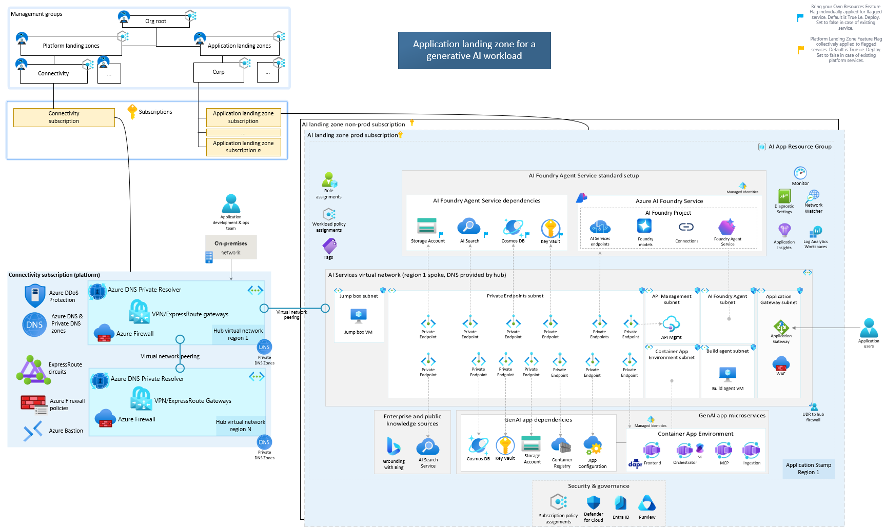

# AI Landing Zone (Bicep AVM Pattern)

This repository contains the **Bicep code** for the **AI Landing Zone Architecture**, published as an [Azure Verified Module](https://aka.ms/avm) Pattern. It provides a landing zone tailored for **generative AI application workloads**, automating deployment of a secure and configurable environment on Azure.

## Architecture

The architecture delivers a full **AI Landing Zone** with **Azure AI Foundry** at the core. The **AI Foundry Agent service** runs together with its main dependencies — **Azure AI Search, Cosmos DB, Storage, and Key Vault** — inside a secured **Azure Container Apps** environment. Additional services for configuration, data handling, and observability are included. Because the design is component-based, you can deploy the complete stack or only the parts that match your project needs.

*AI Landing Zone*

Flexibility comes from **feature toggles**: you choose whether to create, reuse, or share each service between your application and AI Foundry. This approach supports both greenfield deployments and integration with an existing platform landing zone.

When network isolation is enabled, traffic is routed only through Private Endpoints. Name resolution uses Private DNS zones — either created during deployment or linked from zones already managed at the platform level.

## Documentation

* [**How to deploy the Landing Zone.**](./docs/how_to_use.md)
  Step-by-step instructions on creating or reusing resources, setting up isolation, and configuring parameters. Includes a minimal example and notes on running `azd provision` (make sure the CLI is installed and logged in before you start).

* [**Parameter reference.**](./docs/parameters.md)
  Full list of parameters and objects, aligned with the strongly-typed contracts defined in `types.bicep`.
