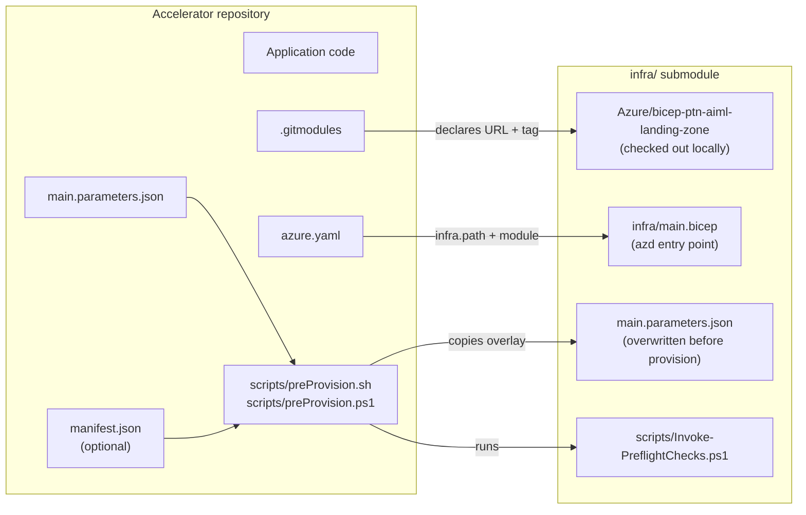
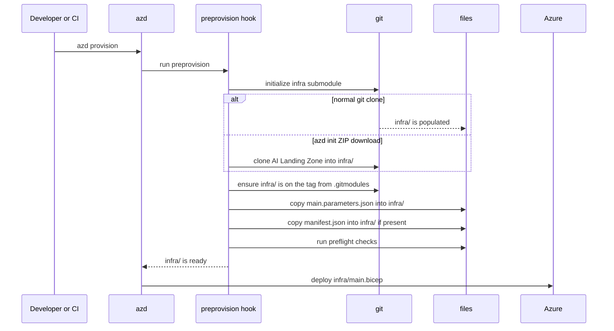

# Building Accelerators on the AI Landing Zone (Submodule Pattern)

This page explains how an accelerator repository can reuse the [AI Landing Zone Bicep implementation](https://github.com/Azure/bicep-ptn-aiml-landing-zone) without copying or forking it.

The pattern is simple: the accelerator owns the application code and its scenario-specific parameter file, while the shared AI Landing Zone Bicep code is brought in as a git submodule under `infra/`.

!!! tip "In one sentence"
    Use `infra/` as a submodule that points to `Azure/bicep-ptn-aiml-landing-zone`, then run a `preprovision` script before `azd provision` so the submodule is initialized, pinned to the expected tag, and overlaid with the accelerator's own `main.parameters.json`.

Reference implementations:

- [Azure/GPT-RAG](https://github.com/Azure/GPT-RAG)
- [Azure/live-voice-practice](https://github.com/Azure/live-voice-practice)

## When to use this pattern

Use this approach when you are building a new accelerator that should deploy on top of the AI Landing Zone but should not maintain its own copy of the Bicep modules.

It gives you:

- **Reuse:** common infrastructure stays in the AI Landing Zone repository.
- **Scenario defaults:** the accelerator can provide its own `main.parameters.json`.
- **Version control:** the accelerator pins the AI Landing Zone to a tested tag, such as `v2.0.2`.
- **`azd init` support:** the setup works even when an accelerator is downloaded as a ZIP by `azd init -t`.
- **Custom checks:** add accelerator-specific validation before AI Landing Zone checks.

## The pattern in one picture



At provision time, `azd` uses `infra/main.bicep` from the submodule, but it does **not** use the default parameters from the submodule. The accelerator's root-level `main.parameters.json` is copied into `infra/main.parameters.json` first.

That copy is intentional. It lets each accelerator keep its scenario defaults close to the application code while still reusing the shared Bicep implementation.

## Required files

The pattern is made of five small pieces.

**1. `.gitmodules`**

Declares the AI Landing Zone repository as a submodule and records the version the accelerator expects.

```ini
[submodule "infra"]
    path = infra
    url = https://github.com/Azure/bicep-ptn-aiml-landing-zone.git
    branch = v2.0.2
    ignore = dirty
```

Important details:

- `path = infra` must match `infra.path` in `azure.yaml`.
- `branch = v2.0.2` is used as the version pin. In practice this value should be a tag.
- `ignore = dirty` avoids noisy `git status` output because the preprovision script overwrites files inside `infra/`.

!!! note
    Git submodules are normally pinned by a gitlink commit. The accelerator scripts also read the `branch` value from `.gitmodules` and force-checkout that ref inside `infra/`. This makes `.gitmodules` the easy-to-read source of truth for the AI Landing Zone version.

**2. `azure.yaml`**

Tells `azd` that the Bicep entry point lives in `infra/` and registers the hook that prepares that folder.

```yaml
name: my-accelerator
metadata:
  template: my-accelerator
infra:
  provider: bicep
  path: infra
  module: main
hooks:
  preprovision:
    posix:
      shell: sh
      run: scripts/preProvision.sh
      interactive: true
    windows:
      shell: pwsh
      run: scripts/preProvision.ps1
      interactive: true
```

The important line is `infra.path: infra`. It must point to the submodule folder.

**3. `scripts/preProvision.sh` and `scripts/preProvision.ps1`**

These scripts are the glue. They run before `azd` evaluates Bicep parameters.

They should:

1. Initialize the `infra/` submodule.
2. Fall back to a direct clone when `azd init -t` downloaded the accelerator as a ZIP.
3. Checkout the AI Landing Zone tag declared in `.gitmodules`.
4. Copy the root `main.parameters.json` into `infra/main.parameters.json`.
5. Copy `manifest.json` into `infra/manifest.json` when the accelerator has one.
6. Run any accelerator-specific checks.
7. Delegate to `infra/scripts/Invoke-PreflightChecks.ps1`.

For a new accelerator, start from the [Azure/GPT-RAG](https://github.com/Azure/GPT-RAG) scripts because they show the generic flow: prepare `infra/`, copy the accelerator parameters, and run the AI Landing Zone preflight checks. Use [Azure/live-voice-practice](https://github.com/Azure/live-voice-practice) as a second reference only when your accelerator has nested boolean parameters that must be converted before deployment.

**4. `main.parameters.json`**

This file lives in the accelerator repository root. During `preprovision`, it replaces the submodule's `infra/main.parameters.json`.

Use it to set the accelerator defaults:

```jsonc
{
  "$schema": "https://schema.management.azure.com/schemas/2019-04-01/deploymentParameters.json#",
  "contentVersion": "1.0.0.0",
  "parameters": {
    "environmentName": { "value": "${AZURE_ENV_NAME}" },
    "location": { "value": "${AZURE_LOCATION}" },
    "principalId": { "value": "${AZURE_PRINCIPAL_ID}" },
    "appConfigLabel": { "value": "my-accelerator" },
    "networkIsolation": { "value": "${NETWORK_ISOLATION=false}" },
    "deployContainerApps": { "value": "true" },
    "deploySearchService": { "value": "true" }
  }
}
```

!!! warning "This is not a JSON merge"
    The script copies the file with overwrite semantics. Your root `main.parameters.json` must be complete for the AI Landing Zone tag you pinned. When you upgrade the tag, compare your file with the new `infra/main.parameters.json`.

**5. `manifest.json` (optional)**

Use this only when you want to record release metadata, such as the accelerator tag and the AI Landing Zone tag it was tested with.

```json
{
  "tag": "v0.1.0",
  "repo": "https://github.com/myorg/my-accelerator.git",
  "ailz_tag": "v2.0.2",
  "components": []
}
```

## What happens during `azd provision`

The `preprovision` hook prepares `infra/` before `azd` compiles and deploys Bicep.



Two implementation details are worth understanding:

**ZIP fallback:** `azd init -t <repo>` can download a ZIP instead of doing a full git clone. ZIP files do not preserve submodule metadata, so `infra/` may be empty. The script detects this and clones the AI Landing Zone directly using the URL and tag from `.gitmodules`.

**Version re-pin:** this runs after both paths. In a normal git clone, the submodule may already be on the expected version, so this step is usually just a confirmation. In the ZIP fallback path, it is required because the script cloned `infra/` directly. In both cases, the readable tag in `.gitmodules` is treated as the version the accelerator expects.

<a id="boolean-rewrite-edge-case"></a>

**Boolean rewrite edge case**

This is an exception, not the normal pattern. Most accelerators should not need it.

It exists because `azd` parameter substitution starts from text. A value such as `"${NETWORK_ISOLATION=false}"` is first written as the string `"false"`.

When the Bicep parameter itself is typed as `bool`, ARM can usually convert that top-level string into a real boolean. But when the boolean is inside an object parameter, ARM sees only an `object`. It does not know that one nested field should be a boolean, so the value may remain the string `"false"` instead of the boolean `false`.

Example:

```jsonc
"publicIngress": {
  "value": {
    "enabled": "${PUBLIC_INGRESS_ENABLED=false}",
    "frontendHostName": "${PUBLIC_INGRESS_FRONTEND_HOSTNAME=}"
  }
}
```

If `enabled` must be a real boolean, the preprovision script can rewrite only that field before deployment:

```jsonc
"enabled": false
```

Avoid this when possible. Prefer top-level boolean parameters, or fixed JSON booleans such as `true` and `false`, when the value does not need to come from an environment variable.

The `live-voice-practice` accelerator contains an example of this logic. Use that approach only if you need the same behavior: after copying `main.parameters.json` into `infra/`, update the copied file so the specific nested field, such as `publicIngress.value.enabled`, is written as JSON boolean `true` or `false` instead of string `"true"` or `"false"`.

## Step-by-step setup

Follow these steps when creating a new accelerator.

**1. Add the submodule**

```bash
git submodule add -b v2.0.2 https://github.com/Azure/bicep-ptn-aiml-landing-zone.git infra
```

Then edit `.gitmodules` and add `ignore = dirty`:

```ini
[submodule "infra"]
    path = infra
    url = https://github.com/Azure/bicep-ptn-aiml-landing-zone.git
    branch = v2.0.2
    ignore = dirty
```

**2. Add `azure.yaml`**

Create an `azure.yaml` with:

- `infra.provider: bicep`
- `infra.path: infra`
- `infra.module: main`
- `hooks.preprovision` pointing to both `scripts/preProvision.sh` and `scripts/preProvision.ps1`

Use the example in [Required files](#required-files) as the starting point.

**3. Copy the preprovision scripts**

Copy both scripts from a reference accelerator:

- `scripts/preProvision.sh`
- `scripts/preProvision.ps1`

Keep the generic submodule, overlay, and AI Landing Zone preflight behavior. Remove only checks that are specific to the reference accelerator you copied from.

**4. Create the root `main.parameters.json`**

Start from the `infra/main.parameters.json` file from the AI Landing Zone tag you pinned. Copy it to the accelerator repository root and then change only the values needed by your scenario.

Typical changes include:

- enabling or disabling services;
- setting `appConfigLabel`;
- setting model, search, networking, or container defaults;
- adding accelerator-specific parameters.

**5. Add `manifest.json` only if useful**

If your accelerator needs release traceability, add `manifest.json`. If not, skip it.

**6. Ignore local azd state**

Add `.azure/` to `.gitignore`.

```gitignore
.azure
```

**7. Test the flow**

```bash
git clone --recurse-submodules https://github.com/myorg/my-accelerator.git
cd my-accelerator
azd init
azd env set AZURE_LOCATION eastus2
azd provision
```

During provisioning, the script should print messages similar to:

```text
Initializing infrastructure submodule...
Pinning infra submodule to 'v2.0.2'...
Applying project main.parameters.json to infra...
Running landing-zone preflight checks...
```

## Upgrade and local workflow

To upgrade the AI Landing Zone version:

1. Change `branch = v2.0.2` in `.gitmodules` to the new tag.
2. Checkout the same tag inside `infra/`.
3. Reconcile your root `main.parameters.json` with the new tag's default file.
4. Update `manifest.json` if you use it.
5. Test with `azd provision` in a non-production environment.

Example:

```bash
cd infra
git fetch --tags
git checkout v2.1.0
cd ..
git add infra .gitmodules main.parameters.json manifest.json
git commit -m "Bump AI Landing Zone to v2.1.0"
```

For local development:

- Clone with `git clone --recurse-submodules <repo-url>`.
- If `infra/` is empty, run `git submodule update --init --recursive`.
- To see the current AI Landing Zone version, run `git -C infra describe --tags`.
- Do not edit `infra/main.parameters.json` directly. Edit the root `main.parameters.json`; the hook will copy it into `infra/`.

## Code agent checklist

Use this checklist when automating the pattern in a new accelerator.

Required changes:

1. Add the `infra` submodule pointing to `https://github.com/Azure/bicep-ptn-aiml-landing-zone.git`.
2. Ensure `.gitmodules` has `path = infra`, `branch = <tag>`, and preferably `ignore = dirty`.
3. Ensure `azure.yaml` has `infra.path: infra`, `infra.module: main`, and a `preprovision` hook for POSIX and Windows.
4. Copy `scripts/preProvision.sh` and `scripts/preProvision.ps1` from a reference accelerator.
5. Keep the generic script behavior: initialize submodule, handle ZIP fallback, checkout the pinned tag, copy parameters, copy manifest if present, and run AI Landing Zone preflight checks.
6. Create a complete root `main.parameters.json` for the pinned AI Landing Zone tag.
7. Add `manifest.json` only if the accelerator needs release metadata.
8. Add `.azure/` to `.gitignore`.

Validation checks:

```bash
test -f infra/main.bicep
grep -q 'bicep-ptn-aiml-landing-zone' .gitmodules
grep -q 'path: infra' azure.yaml
grep -q 'preprovision:' azure.yaml
jq . main.parameters.json > /dev/null
```

Invariants to preserve:

- `azure.yaml` and `.gitmodules` must both point to `infra`.
- The `.gitmodules` `branch` value should be a released AI Landing Zone tag.
- The root `main.parameters.json` must match the schema expected by the pinned AI Landing Zone tag.
- Accelerator-specific checks should run before the AI Landing Zone preflight checks.
- Preflight logic should honor `PREFLIGHT_SKIP=true` when the reference script supports it.

## References and next steps

Reference accelerators:

- [Azure/GPT-RAG](https://github.com/Azure/GPT-RAG) - good baseline for the submodule pattern.
- [Azure/live-voice-practice](https://github.com/Azure/live-voice-practice) - useful when you need an example of nested boolean rewriting.

Related documentation:

- [How to Deploy](how-to-deploy.md)
- [Parameterization](parameterization.md)
- [Hub-and-Spoke Topology](hub-and-spoke.md)
