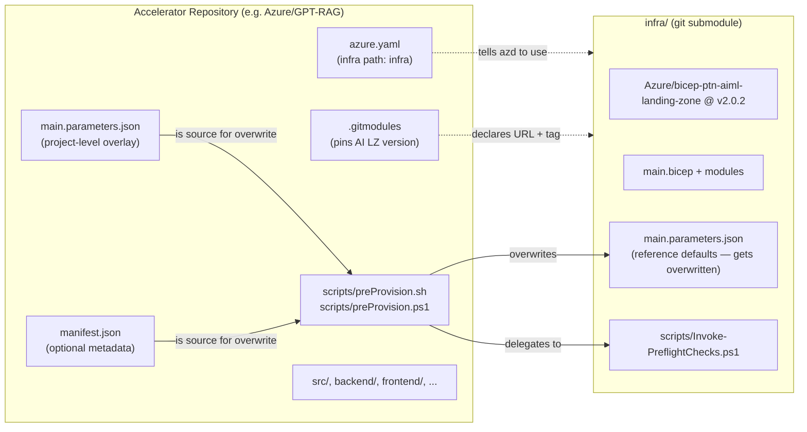
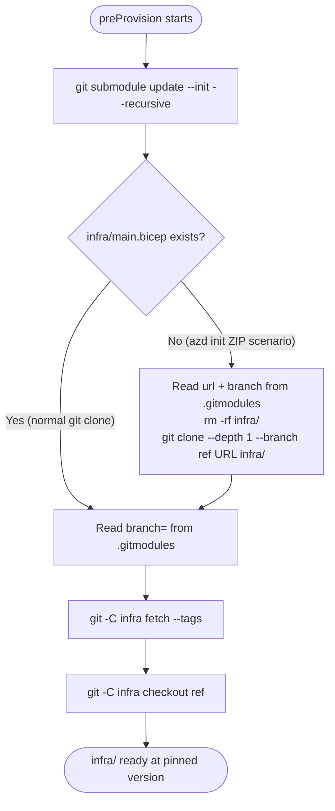
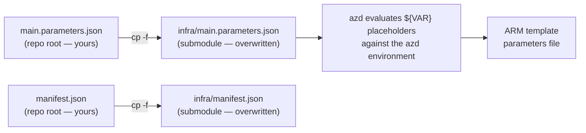

# Building Accelerators on the AI Landing Zone (Submodule Pattern)

This page documents the **submodule pattern** used by Azure accelerators to consume the [bicep-ptn-aiml-landing-zone](https://github.com/Azure/bicep-ptn-aiml-landing-zone) infrastructure as a git submodule. It explains the mechanism end-to-end and gives you a copy-paste-ready recipe to replicate it in a new accelerator repository.

**Audience:** developers and code agents building new accelerators on top of the AI Landing Zone.

**Reference implementations:**

- [Azure/GPT-RAG](https://github.com/Azure/GPT-RAG) — chat-with-your-data RAG accelerator
- [Azure/live-voice-practice](https://github.com/Azure/live-voice-practice) — real-time voice agent accelerator

!!! tip "TL;DR"
    Your accelerator repo holds **application code + a thin infra overlay**. The AI Landing Zone is consumed as a git submodule at `infra/`. At `azd provision` time, a `preprovision` hook (`scripts/preProvision.{sh,ps1}`) does three things in order:

    1. **Bootstraps** the submodule (even when the repo was downloaded as a ZIP).
    2. **Pins** it to the version declared in `.gitmodules`.
    3. **Overlays** your `main.parameters.json` (and optional `manifest.json`) on top of the submodule.

## Why this pattern?

| Concern | What this pattern gives you |
|---|---|
| **Reuse** | The AI Landing Zone is maintained in one place; every accelerator inherits fixes, new services, and security hardening for free. |
| **Override** | Each accelerator decides its own defaults (toggles, regions, model deployments) via a project-level `main.parameters.json` without forking the infra. |
| **Pinning** | Each accelerator declares the exact AI LZ version (e.g. `v2.0.2`) it was tested against. Upgrades become a one-line `.gitmodules` change. |
| **`azd init` compatibility** | The bootstrap script handles the ZIP-download path that `azd init -t <template>` uses, where git submodule entries do not exist. |
| **Composition** | Accelerator-specific pre-flight checks (e.g. region/quota validation) can run alongside the AI LZ's own pre-flight checks. |

## High-level layout



## What happens during `azd provision`

```mermaid
sequenceDiagram
    participant Dev as Developer / CI
    participant AZD as azd
    participant PP as preProvision (hook)
    participant Git as git
    participant FS as Filesystem
    participant ARM as Azure Resource Manager

    Dev->>AZD: azd provision
    AZD->>PP: run preprovision hook
    PP->>Git: git submodule update --init --recursive
    alt Normal git clone path
        Git-->>FS: populate infra/ from gitlink
    else azd init ZIP path
        Note over PP,Git: gitlink is missing;<br/>submodule stays empty
        PP->>FS: read URL & ref from .gitmodules
        PP->>Git: git clone --depth 1 --branch <ref> URL infra/
        Git-->>FS: populate infra/
    end
    PP->>Git: fetch + checkout <ref> from .gitmodules (pin)
    PP->>FS: cp main.parameters.json infra/main.parameters.json
    PP->>FS: cp manifest.json infra/manifest.json
    opt Boolean rewrites (object-typed params)
        PP->>FS: rewrite ${BOOL} placeholders ARM cannot coerce
    end
    PP->>FS: run accelerator preflight + Invoke-PreflightChecks.ps1
    PP-->>AZD: success
    AZD->>ARM: deploy infra/main.bicep with infra/main.parameters.json
    ARM-->>AZD: deployment outputs
    AZD-->>Dev: provisioned
```

## The five files that wire it together

### 1. `.gitmodules` — declares the submodule and pins a version

```ini
[submodule "infra"]
    path = infra
    url = https://github.com/Azure/bicep-ptn-aiml-landing-zone.git
    branch = v2.0.2
    ignore = dirty
```

- **`path = infra`** — where the AI LZ lives in your repo. `azure.yaml` must point at the same path.
- **`url`** — always the canonical AI LZ repo.
- **`branch`** — the git ref to use. Despite the field name, this can be a **tag** (the recommended approach for reproducibility). The preProvision script reads this value at runtime to force-checkout the right version, so bumping the AI LZ version becomes a one-line change in this file.
- **`ignore = dirty`** *(optional)* — tells `git status` not to flag working-tree changes inside `infra/`, which would otherwise be noisy because the script overwrites files there.

!!! note "Why the `branch` field doubles as a version pin"
    Standard git doesn't support pinning a submodule to a tag via `.gitmodules` alone — it tracks a commit (gitlink) instead. The preProvision script bridges this gap: it reads `branch = <value>` from `.gitmodules` and runs `git checkout <value>` inside `infra/`, so you can pin to a tag like `v2.0.2` and developers get the right version regardless of what commit the gitlink points at.

### 2. `azure.yaml` — points azd at the submodule and registers hooks

```yaml
# yaml-language-server: $schema=https://raw.githubusercontent.com/Azure/azure-dev/main/schemas/v1.0/azure.yaml.json
name: my-accelerator
metadata:
  template: my-accelerator
infra:
  provider: bicep
  path: infra
  module: main
hooks:
  preprovision:
    posix:
      shell: sh
      run: scripts/preProvision.sh
      interactive: true
    windows:
      shell: pwsh
      run: scripts/preProvision.ps1
      interactive: true
```

- **`infra.path: infra`** matches the submodule `path` in `.gitmodules`. azd compiles `infra/main.bicep` and evaluates `infra/main.parameters.json` at provision time.
- **`hooks.preprovision`** runs `scripts/preProvision.{sh,ps1}` **before** azd evaluates parameters or talks to ARM. This is where the bootstrap and overlay happen.

### 3. `scripts/preProvision.sh` and `scripts/preProvision.ps1` — the engine

These two scripts perform the same work for POSIX and Windows shells. Both follow this contract:

1. **Initialize the submodule**: `git submodule update --init --recursive`.
2. **Detect the `azd init` ZIP scenario** (no `infra/main.bicep` after step 1) and **fall back** to `git clone --depth 1 --branch <ref> <url> infra/`, reading the URL and ref from `.gitmodules`.
3. **Pin to the desired ref** read from `.gitmodules`, even if the parent gitlink points at an older commit. This makes the `branch = v2.0.2` line in `.gitmodules` the single source of truth for the AI LZ version.
4. **Overlay** `main.parameters.json` and `manifest.json` from the project root onto `infra/`.
5. *(Optional)* **rewrite parameters** that ARM cannot string-coerce (see the [boolean rewrite section](#optional-boolean-coercion-rewrite)).
6. **Run accelerator-specific preflight checks** (region readiness, quota, etc.), then **delegate to the AI LZ preflight** at `infra/scripts/Invoke-PreflightChecks.ps1`.
7. **Honour `PREFLIGHT_SKIP=true`** to bypass preflight checks.

You can copy these scripts verbatim from one of the [reference implementations](#reference-implementations) and trim the accelerator-specific section.

### 4. `main.parameters.json` (project root) — your overlay

This is the file that becomes `infra/main.parameters.json` at provision time. The submodule ships its own `main.parameters.json` as the **reference defaults** for the AI LZ, but every accelerator wants to:

- Pre-set feature toggles for the scenario (`deploySpeechService`, `deployContainerApps`, …).
- Hard-code accelerator-specific values (e.g. `"appConfigLabel": "gpt-rag"`).
- Add new parameters that the accelerator's own modules consume.

Because it's a **full overlay** (the script does `cp -f`, not a JSON merge), your overlay must be a complete, valid `main.parameters.json` for the AI LZ version you've pinned. The simplest way to author one is to start from `infra/main.parameters.json` of the pinned AI LZ tag and edit it.

### 5. `manifest.json` (optional) — accelerator metadata

A lightweight JSON file that records the accelerator version, the AI LZ tag it was tested with, and any companion component repositories. It's optional but useful for traceability and for downstream tooling (release notes, version reporting):

```json
{
  "tag": "v2.7.6",
  "repo": "https://github.com/azure/gpt-rag.git",
  "ailz_tag": "v2.0.2",
  "components": [
    {
      "name": "gpt-rag-ui",
      "repo": "https://github.com/azure/gpt-rag-ui.git",
      "tag": "v2.3.7"
    }
  ]
}
```

The preProvision script copies it into the submodule the same way it copies `main.parameters.json`, so Bicep modules can read it as a deployment input if needed.

## The submodule bootstrap mechanism (detailed)

There are three paths the preProvision script handles. All three converge on a populated `infra/` directory pinned to the version declared in `.gitmodules`.



### Why the ZIP fallback exists

`azd init -t Azure/GPT-RAG` does **not** perform a git clone — it downloads a ZIP of the repo from GitHub. ZIPs do not contain the `.git/modules/` metadata or the submodule gitlink. As a result, `git submodule update --init --recursive` silently does nothing and `infra/` stays empty. The script detects this by checking for `infra/main.bicep` and falls back to a direct `git clone` whose URL and ref are read from `.gitmodules`.

### Why the re-pin step exists

The git "gitlink" (the commit SHA recorded in the parent repo's tree for a submodule) may lag behind `.gitmodules`. The standard `git submodule update` honours the gitlink, not `.gitmodules`. The re-pin step forces `infra/` to the ref declared in `.gitmodules`, so **changing the AI LZ version in your accelerator is a one-line edit**.

## The parameters overlay mechanism (detailed)



After the copy:

1. **azd reads `infra/main.parameters.json`.** Every `"${VAR}"` placeholder is replaced with the corresponding `azd env get VAR` value (or the `${VAR=default}` default if unset).
2. **The resulting file is sent to ARM** alongside the compiled `main.bicep`.

### Optional: boolean coercion rewrite

ARM rejects string-to-bool coercion **inside aggregate object properties**. The top-level form works:

```jsonc
"networkIsolation": { "value": "${NETWORK_ISOLATION}" }
```

…because ARM coerces top-level strings to `bool` for a `bool` parameter. The nested form **does not**:

```jsonc
"publicIngress": {
  "value": {
    "enabled": "${PUBLIC_INGRESS_ENABLED=false}",
    "frontendHostName": "${PUBLIC_INGRESS_FRONTEND_HOSTNAME=}"
  }
}
```

The `live-voice-practice` preProvision script handles this by reading `PUBLIC_INGRESS_ENABLED` (falling back to `NETWORK_ISOLATION`) from the azd environment and rewriting the field as a **raw JSON boolean** before azd runs its substitution pass:

```bash
perl -i -pe 's|"enabled":\s*"\$\{PUBLIC_INGRESS_ENABLED[^"]*\}"|"enabled": '"$BOOL_LITERAL"'|' "$INFRA_PARAMS"
```

Use this pattern for any object-typed parameter whose nested fields need to be true booleans.

## Step-by-step: replicate this pattern in a new accelerator

The instructions below assume you start from an empty repository and want to consume AI LZ `v2.0.2` (replace with the tag you want to pin).

**1. Add the submodule and pin to a tag**

```bash
git submodule add -b v2.0.2 https://github.com/Azure/bicep-ptn-aiml-landing-zone.git infra
```

Then edit `.gitmodules` and add `ignore = dirty`:

```ini
[submodule "infra"]
    path = infra
    url = https://github.com/Azure/bicep-ptn-aiml-landing-zone.git
    branch = v2.0.2
    ignore = dirty
```

**2. Create `azure.yaml`**

```yaml
# yaml-language-server: $schema=https://raw.githubusercontent.com/Azure/azure-dev/main/schemas/v1.0/azure.yaml.json
name: my-accelerator
metadata:
  template: my-accelerator
infra:
  provider: bicep
  path: infra
  module: main
hooks:
  preprovision:
    posix:
      shell: sh
      run: scripts/preProvision.sh
      interactive: true
    windows:
      shell: pwsh
      run: scripts/preProvision.ps1
      interactive: true
```

**3. Copy the preProvision scripts**

Copy `scripts/preProvision.sh` and `scripts/preProvision.ps1` from a reference implementation. Both [GPT-RAG](https://github.com/Azure/GPT-RAG/blob/main/scripts/preProvision.sh) and [live-voice-practice](https://github.com/Azure/live-voice-practice/blob/main/scripts/preProvision.sh) are valid starting points:

- **GPT-RAG** is the cleaner baseline.
- **live-voice-practice** additionally rewrites `publicIngress.enabled` as a raw boolean (see [Boolean coercion rewrite](#optional-boolean-coercion-rewrite)).

Strip out any accelerator-specific preflight invocations (e.g. `Invoke-GptRagRegionalPreflight.ps1`) and keep the rest verbatim.

**4. Author `main.parameters.json` (project-level overlay)**

Start by copying `infra/main.parameters.json` from the pinned AI LZ tag to your repo root, then edit it to set your accelerator's defaults. Add an accelerator label so you can identify resources you own:

```jsonc
{
  "$schema": "https://schema.management.azure.com/schemas/2019-04-01/deploymentParameters.json#",
  "contentVersion": "1.0.0.0",
  "parameters": {
    "environmentName": { "value": "${AZURE_ENV_NAME}" },
    "location":        { "value": "${AZURE_LOCATION}" },
    "principalId":     { "value": "${AZURE_PRINCIPAL_ID}" },
    "appConfigLabel":  { "value": "my-accelerator" },

    "networkIsolation":     { "value": "${NETWORK_ISOLATION=false}" },
    "deployContainerApps":  { "value": "true" },
    "deploySearchService":  { "value": "true" }
    // ... add the rest based on your scenario
  }
}
```

!!! warning "The overlay is a full replacement"
    `preProvision` does `cp -f`, **not** a JSON merge. Your overlay must be a complete, valid parameters file for the AI LZ version you've pinned. Whenever you bump the AI LZ tag, diff against the new `infra/main.parameters.json` and update your overlay.

**5. (Optional) Create `manifest.json`**

```json
{
  "tag": "v0.1.0",
  "repo": "https://github.com/myorg/my-accelerator.git",
  "ailz_tag": "v2.0.2",
  "components": []
}
```

**6. Update `.gitignore`**

Add `.azure/` so azd local environment files aren't committed:

```gitignore
.azure
```

**7. Verify locally**

```bash
git clone --recurse-submodules https://github.com/myorg/my-accelerator.git
cd my-accelerator
azd init                  # links the repo to an azd environment name
azd env set AZURE_LOCATION eastus2
azd provision             # triggers the preprovision hook
```

You should see the preProvision script print something like:

```text
Initializing infrastructure submodule...
Pinning infra submodule to 'v2.0.2'...
Applying project main.parameters.json to infra...
Applying project manifest.json to infra...
Running landing-zone preflight checks...
```

…before azd starts provisioning resources.

**8. Commit**

```bash
git add .gitmodules infra azure.yaml scripts/ main.parameters.json manifest.json .gitignore
git commit -m "Wire AI Landing Zone v2.0.2 as a submodule"
```

## Pinning and upgrading the AI Landing Zone version

To bump the AI LZ version that your accelerator uses:

**1.** Edit `.gitmodules` and change `branch = v2.0.2` to the new tag.

**2.** Update the gitlink so a fresh `git clone --recurse-submodules` lands on the same commit:

```bash
cd infra
git fetch --tags
git checkout v2.1.0
cd ..
git add infra .gitmodules
git commit -m "Bump AI LZ to v2.1.0"
```

**3.** Reconcile your `main.parameters.json` overlay against the new tag's `infra/main.parameters.json` — new parameters may have been added; old ones may have been renamed.

**4.** If `manifest.json` exists, update its `ailz_tag` field.

**5.** Re-run `azd provision` in a test environment and verify the preflight checks still pass.

## Working with the submodule locally

**Clone a repository that uses this pattern:**

```bash
git clone --recurse-submodules https://github.com/Azure/GPT-RAG.git
```

If you forgot `--recurse-submodules`:

```bash
git submodule update --init --recursive
```

**See which version you're on:**

```bash
cd infra
git describe --tags
```

**Local edits to `infra/`:** don't. The preProvision script will overwrite `infra/main.parameters.json` and `infra/manifest.json` on every run. Edit the repo-root copies instead. For changes to Bicep modules, contribute them upstream in [Azure/bicep-ptn-aiml-landing-zone](https://github.com/Azure/bicep-ptn-aiml-landing-zone).

## Reference for code agents

When asked to set up the submodule pattern in an accelerator, follow this deterministic checklist. Each step is idempotent.

| # | File | Action | Verification |
|---|---|---|---|
| 1 | `.gitmodules` | Add the `[submodule "infra"]` block pointing to the AI LZ repo, with `branch = <tag>`. | `grep -q 'bicep-ptn-aiml-landing-zone' .gitmodules` |
| 2 | `infra/` | `git submodule add -b <tag> https://github.com/Azure/bicep-ptn-aiml-landing-zone.git infra` | `test -f infra/main.bicep` |
| 3 | `azure.yaml` | Set `infra.path: infra`, `infra.module: main`, register the `preprovision` hook running `scripts/preProvision.{sh,ps1}`. | `grep -q 'path: infra' azure.yaml && grep -q 'preprovision:' azure.yaml` |
| 4 | `scripts/preProvision.sh` | Copy from a reference. Must include: (a) `git submodule update --init --recursive`; (b) ZIP fallback that clones from `.gitmodules`; (c) re-pin to ref from `.gitmodules`; (d) overlay copy of `main.parameters.json` and `manifest.json`; (e) delegation to `infra/scripts/Invoke-PreflightChecks.ps1`. | Run preProvision manually — script must exit 0 and `infra/main.bicep` must exist after. |
| 5 | `scripts/preProvision.ps1` | Same contract as `.sh`. | Same as above on Windows. |
| 6 | `main.parameters.json` | Complete parameter overlay for the pinned AI LZ tag. | `jq . main.parameters.json > /dev/null` |
| 7 | `manifest.json` *(optional)* | Record `tag`, `repo`, `ailz_tag`. | `jq . manifest.json > /dev/null` |
| 8 | `.gitignore` | Include `.azure`. | `grep -q '^\.azure$' .gitignore` |

**Invariants the agent must preserve:**

- `infra.path` in `azure.yaml` **must equal** `path` in `.gitmodules` for the `infra` submodule.
- The `branch` field in `.gitmodules` **must** be a tag that exists on `https://github.com/Azure/bicep-ptn-aiml-landing-zone`.
- The project-level `main.parameters.json` **must** be valid against the schema of the pinned AI LZ tag (compare it to `infra/main.parameters.json` after step 2).
- The preProvision script **must not** be modified in ways that break the seven-step contract above; accelerator-specific logic goes **before** the AI LZ preflight invocation.
- Any accelerator-specific preflight script **must** honour `PREFLIGHT_SKIP=true` for symmetry with the AI LZ preflight.

## Reference implementations

| Accelerator | AI LZ tag pinned | What it adds on top of the baseline |
|---|---|---|
| [Azure/GPT-RAG](https://github.com/Azure/GPT-RAG) | `v2.0.2` | Regional preflight (`Invoke-GptRagRegionalPreflight.ps1`) that validates region, VM SKU, model quota before the AI LZ preflight runs. Adds `predeploy` and `postprovision` hooks for application wiring. |
| [Azure/live-voice-practice](https://github.com/Azure/live-voice-practice) | `v1.1.9` | In-place `publicIngress.enabled` boolean rewrite, plus `predeploy`/`postdeploy` hooks for container image build and seed data. |

## Next steps

- [How to Deploy](how-to-deploy.md) — the standalone AI LZ deployment flow that your accelerator builds on.
- [Parameterization](parameterization.md) — the full parameter reference your `main.parameters.json` overlay targets.
- [Hub-and-Spoke Topology](hub-and-spoke.md) — for accelerators that need to land into an existing platform landing zone.
