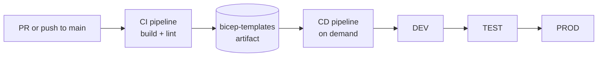
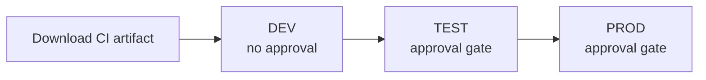

# Deploy with Azure DevOps

This guide explains how to deploy the AI Landing Zone (Bicep) from Azure DevOps
Pipelines. It covers what the pipelines do, what you need to set up first, how to
wire everything together in your project, and how the pipelines relate to the
pre-flight checks that run before each deployment.

Use this when you want repeatable, gated deployments to Dev, Test, and Prod
instead of running `azd provision` by hand. If you only need a one-off local
deployment, see [How to Deploy](how-to-deploy.md) instead.

The pipeline assets live in the landing zone repository under
`pipelines/azuredevops/`. This page is the source of truth for setup and usage;
the YAML files in that folder are the assets it references.

## What the pipelines do

There are two pipelines that work together.

**CI pipeline (`ci-pipeline.yml`)** validates the Bicep templates. It runs on
pull requests and on pushes to `main`, filtered to the paths that affect the
deployment (`*.bicep`, `*.json`, `modules/`, `constants/`, and
`pipelines/azuredevops/`). It has a single `Validate` stage that:

- installs the Bicep CLI,
- compiles the template with `az bicep build`,
- lints the template with `az bicep lint`,
- publishes the repository as a pipeline artifact named `bicep-templates`.

No Azure sign-in or provisioning happens in CI. It only proves the templates are
well formed, and it hands a validated artifact to the CD pipeline.

**CD pipeline (`cd-pipeline.yml`)** deploys the landing zone. It does not trigger
automatically (`trigger: none` and `pr: none`); you run it on demand and choose
which environments to promote to. It consumes the artifact produced by CI rather
than rebuilding from source, then promotes through Dev, Test, and Prod with
manual approval gates on the environments you choose to protect.

### Deployment stages and gating

When you queue the CD pipeline, you pick the environments to deploy with three
boolean parameters: `Deploy to DEV`, `Deploy to TEST`, and `Deploy to PROD`. All
default to off, so a run deploys only what you opt into.

The stages run in a fixed order through stage dependencies: Dev depends on the
artifact download, Test depends on Dev, and Prod depends on Test. If a selected
environment fails, the later environments are skipped. Each environment deploys
with the reusable `deploy-bicep.yml` template, which runs `azd provision` against
that environment.

Approvals are not defined in YAML. They live on the Azure DevOps Environment
resource, so you control them from the portal without editing the pipeline. The
recommended setup is no approval on `dev` and a required approval on `test` and
`prod`. When an approval is configured, the pipeline pauses before that stage
until an approver allows it to continue.

### Reusable templates

The pipelines are built from small templates under
`pipelines/azuredevops/templates/`:

- `validate-bicep.yml` compiles and lints the template and publishes the
  artifact. Used by CI.
- `deploy-bicep.yml` installs `azd` and the Bicep CLI, resolves the deploying
  principal, sets the azd environment, and runs `azd provision` with an optional
  retry loop. Used by each CD stage.
- `preview-bicep.yml` runs `azd provision --preview` (a what-if) against a target
  environment. It is provided for teams that want a preview step before deploy.
- `variables.yml` holds the shared values you fill in for your environment.

## Prerequisites

Before the first run, set up the following in Azure DevOps.

**1. Service connections.** Create one Azure Resource Manager service connection
per environment you plan to use (Dev, Test, Prod). Each service principal needs
`Contributor` and `User Access Administrator` on the target subscription, because
the landing zone creates resources and assigns roles. You will reference these
connection names in `variables.yml`.

**2. Environments.** Create Azure DevOps Environments named `dev`, `test`, and
`prod`. Add an approval check on `test` and `prod` so deployments to those
environments pause for a human. Leave `dev` without an approval for fast
iteration.

**3. Variable group.** Create a variable group named `ailz-secrets` and add a
secret variable `secretOrRandomPassword`. This value is used as the jumpbox VM
admin password in Zero Trust deployments. Link the group to the CD pipeline.

**4. Fill in `variables.yml`.** Edit
`pipelines/azuredevops/templates/variables.yml` and set the values for your
environment:

| Variable | What to set |
| --- | --- |
| `azureServiceConnectionDev` | Name of the Dev ARM service connection |
| `azureServiceConnectionTest` | Name of the Test ARM service connection |
| `azureServiceConnectionProd` | Name of the Prod ARM service connection |
| `location` | Azure region for the deployment, for example `eastus2` |
| `environmentName` | Base azd environment name, default `ailz-bicep` |
| `deploymentMode` | `zeroTrust` for network isolation, or `basic` for public networking |
| `agentPool` | `ubuntu-latest` for Microsoft-hosted agents, or your self-hosted pool name |
| `deployRetryCount` | Extra `azd provision` attempts on transient Azure failures, default `0` |
| `templateFile` | Bicep entry point, default `main.bicep` |

The `deploymentMode` value maps directly to network isolation. `zeroTrust` sets
`NETWORK_ISOLATION true` (VNet, private endpoints, Bastion), and `basic` sets it
to `false` for public networking. This is the same toggle described in
[How to Deploy](how-to-deploy.md).

!!! note
    The pipelines deploy with the Azure Developer CLI (`azd provision`), which
    handles resource group creation, parameter filtering, and principal ID
    resolution. You do not need to pre-create the resource group.

## How to wire it up in Azure DevOps

**1. Create the CI pipeline.** In your Azure DevOps project, go to Pipelines, New
pipeline, point it at this repository, and select
`pipelines/azuredevops/ci-pipeline.yml`. Name it exactly `AI Landing Zone - CI`.
The CD pipeline references the CI pipeline by that name to pull its artifact, so
the name must match.

**2. Create the CD pipeline.** Create a second pipeline from
`pipelines/azuredevops/cd-pipeline.yml`. Link the `ailz-secrets` variable group
to it (Edit, Variables, Variable groups).

**3. Run a deployment.** Run the CD pipeline manually. Turn on `Deploy to DEV`
to start, and add `Deploy to TEST` or `Deploy to PROD` when you are ready to
promote. The run downloads the CI-validated artifact, then deploys to each
selected environment in order, pausing at any environment that has an approval
gate.

!!! tip
    For strict promotion where Test must wait for a successful Dev run, change
    the Test stage condition to require `succeeded('Dev')`. The default condition
    uses `not(failed())`, which lets you deploy directly to Test or Prod without
    deploying Dev first.

## Relationship to the pre-flight checks

Every deployment runs the repository pre-flight script,
`scripts/Invoke-PreflightChecks.ps1`, through the `azd` preprovision hook before
anything reaches Azure Resource Manager. The pipelines do not call the script
directly. They run `azd provision`, and azd runs the hook.

The script is read-only and never changes Azure state. It catches the common
topology mistakes that otherwise surface as deep, late ARM errors, such as
conflicting Private DNS settings, mutually exclusive hub-integration parameters,
invalid IP allow-list shapes, subnet prefixes that overflow or overlap, subnets
too small for the services that use them, and bring-your-own resources that were
promised but do not exist. It also checks regional readiness, including provider
registration, jumpbox VM SKU availability, and AI model quota.

If a check fails, the deployment stops before ARM is called, and the pipeline
reports the failure. You can narrow or skip checks with the script switches and
environment variables documented in the script header, for example
`LZ_PREFLIGHT_REGIONAL_SKIP` to skip only the regional block, or
`PREFLIGHT_SKIP` as an emergency escape hatch. Skipping is meant for unblocking,
not for normal runs.

## Troubleshooting

**The CD pipeline cannot find the CI artifact.** Confirm the CI pipeline is named
exactly `AI Landing Zone - CI` and that it has run successfully at least once, so
the `bicep-templates` artifact exists.

**Deployment fails with a missing password error.** Confirm the `ailz-secrets`
variable group is linked to the CD pipeline and contains a secret variable named
`secretOrRandomPassword`.

**Deployment fails resolving the deployment principal.** Set the
`AZURE_PRINCIPAL_ID` pipeline variable to the Entra object ID of the deploying
identity. The deploy template tries to resolve it automatically from the service
connection, but you can set it explicitly if resolution fails.

**Role assignment errors during provisioning.** Confirm the service principal
behind the environment's service connection has both `Contributor` and
`User Access Administrator` on the target subscription.
