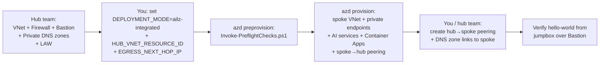

# Hub-and-Spoke Topology

This page summarizes the **hub-and-spoke** deployment topology introduced in **v2.0.0**: the AI Landing Zone spoke peers to a hub VNet that hosts shared platform services (Azure Firewall, Bastion, Private DNS zones, Log Analytics workspace).

For the full end-to-end walkthrough — including the minimal test hub Bicep template, IP planning, peering setup, post-provisioning steps from the jumpbox, and the verification checklist — read the source runbook at [docs/runbook-hub-spoke.md](https://github.com/Azure/bicep-ptn-aiml-landing-zone/blob/main/docs/runbook-hub-spoke.md).

## When to use this topology

Pick hub-and-spoke when **any** of the following applies:

- A platform team already operates a corporate hub VNet (Connectivity subscription) with Azure Firewall and a central Bastion.
- DNS, identity, monitoring, or networking policy is centrally managed by a different team than the one shipping the AI workload.
- Multiple AI workloads (or other workloads) need to share egress, jumpbox, and DNS resolution.
- You are integrating the AI Landing Zone into an [Azure Landing Zone](https://learn.microsoft.com/en-us/azure/cloud-adoption-framework/ready/landing-zone/) (CAF).

## What the spoke creates vs. consumes

| Resource | Spoke creates | Consumes from hub |
|---|---|---|
| Spoke VNet, subnets, NSGs | ✅ | — |
| Private endpoints for AI services | ✅ | — |
| AI Foundry, AI Search, Cosmos DB, Storage, ACR, App Config, Key Vault | ✅ | — |
| Container Apps environment + workload profiles | ✅ | — |
| Log Analytics workspace | Optional | ✅ via `existingPlatformServices.logAnalyticsWorkspaceResourceId` |
| Application Insights | Optional | ✅ via `existingPlatformServices.applicationInsightsResourceId` |
| Private DNS zones (15 namespaces) | Optional, per-zone | ✅ via `existingPrivateDnsZones.*` |
| Azure Firewall | Optional | ✅ via `hubIntegration.egressNextHopIp` |
| Bastion | Optional | ✅ (hub Bastion reaches spoke jumpbox via peering) |
| Jumpbox VM | Optional | ✅ via `existingJumpboxResourceId` |
| NAT Gateway | Optional | — (typically the hub firewall provides egress) |
| Spoke→hub VNet peering | ✅ (created by `main.bicep`) | — |

## Minimum parameters

For an AI LZ Integrated deployment:

```bash
azd env set DEPLOYMENT_MODE                  ailz-integrated
azd env set HUB_VNET_RESOURCE_ID             "/subscriptions/<sub>/resourceGroups/<hub-rg>/providers/Microsoft.Network/virtualNetworks/<hub-vnet>"
azd env set EGRESS_NEXT_HOP_IP               "<hub firewall private IP>"
azd env set NETWORK_ISOLATION                true

# Recommended: reuse hub observability
azd env set EXISTING_LOG_ANALYTICS_WORKSPACE_ID "/subscriptions/.../workspaces/<law>"
azd env set EXISTING_APPLICATION_INSIGHTS_ID    "/subscriptions/.../components/<ai>"
```

If your hub also hosts the standard Private DNS zones, set each `EXISTING_PRIVATE_DNS_ZONE_*` variable to its hub resource ID. See [Parameterization](parameterization.md) for the complete list of 15 zone parameters.

## Network planning

The spoke VNet address space must not overlap with the hub VNet. The default spoke prefix (`10.0.0.0/22`) is safe for a hub on `10.100.0.0/16`. If your hub uses a different prefix, set:

```bash
azd env set VNET_ADDRESS_PREFIXES "[\"10.200.0.0/22\"]"
```

Subnet minimums enforced by the pre-flight script:

| Subnet | Minimum size | Notes |
|---|---|---|
| Container Apps environment | `/27` (consumption), `/23` (workload profiles) | AVM requirement |
| Private endpoints | `/28` | One IP per private endpoint |
| AzureBastionSubnet | `/26` | Fixed by Bastion |
| AzureFirewallSubnet | `/26` | Fixed by Azure Firewall |
| Jumpbox | `/29` | One IP per VM |

## Deployment flow



The pre-flight script catches the most common hub-and-spoke mistakes (typos in `HUB_VNET_RESOURCE_ID`, subnets too small, CIDR overlap with hub, missing ACA delegation on BYO subnets) **before** ARM rejects the deployment 20 minutes in.

## See also

- [Source-repo hub-and-spoke runbook](https://github.com/Azure/bicep-ptn-aiml-landing-zone/blob/main/docs/runbook-hub-spoke.md) — full walkthrough with test-hub Bicep, screenshots, and troubleshooting
- [Migration to v2.0](migration-v2.md) — upgrade path from v1.x
- [Parameterization](parameterization.md) — full parameter reference for the new BYO inputs
- [v2.0.0 release notes](https://github.com/Azure/bicep-ptn-aiml-landing-zone/releases/tag/v2.0.0)
