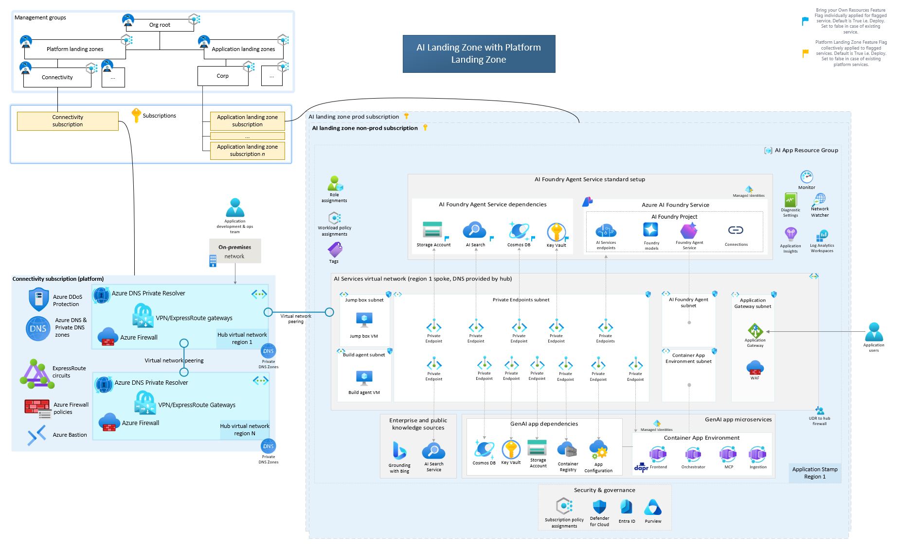

# Azure AI Landing Zone

## Overview

The AI Landing Zone provides an enterprise-scale, production-ready reference architecture with implementations in the Azure Portal, Bicep, and Terraform to deploy secure and resilient AI apps and agents on Azure.    

## Highlights

- The AI Landing Zone is an [application landing zone](https://learn.microsoft.com/en-us/azure/cloud-adoption-framework/ready/landing-zone/#platform-landing-zones-vs-application-landing-zones) that provides a foundation for multiple AI app and agent scenarios, with or without an existing [platform landing zone](https://learn.microsoft.com/en-us/azure/cloud-adoption-framework/ready/landing-zone/#platform-landing-zones-vs-application-landing-zones).
- The Infrastructure-as-Code (IaC) implementations (Bicep and Terraform) are based on [Azure Verified Modules](https://aka.ms/AVM).
- The current scope focuses on [AI on Azure Platform](https://learn.microsoft.com/en-us/azure/cloud-adoption-framework/scenarios/ai/platform/architectures); a future version will cover [AI on Azure Infrastructure](https://learn.microsoft.com/en-us/azure/cloud-adoption-framework/scenarios/ai/infrastructure/cycle-cloud).
- The AI Landing Zone targets Azure public cloud and can be extended to Azure Government and sovereign clouds.
- It supports both generative and non-generative scenarios, aligned with the [CAF AI resource selection guidance](https://learn.microsoft.com/en-us/azure/cloud-adoption-framework/scenarios/ai/platform/resource-selection).
- It uses [Semantic Kernel](https://learn.microsoft.com/en-us/semantic-kernel/overview/) as the orchestration framework.
- To keep up with rapid AI innovation, it may use preview services to enable the latest capabilities.

## Reference Architectures

**AI LZ with Platform Landing Zone**

This diagram shows the recommended reference architecture: the AI Landing Zone deployed alongside an existing Platform Landing Zone.

Use this option when you already have shared platform capabilities in place (for example, centralized networking, DNS, security, and governance) and you want the AI Landing Zone to integrate with them.

**AI LZ without Platform Landing Zone**

This diagram shows the AI Landing Zone as a standalone application landing zone, without a Platform Landing Zone.

Use this option when you need a self-contained deployment for a new environment or a smaller footprint, and you do not need to integrate with shared platform services.

## Extensible Implementations

The table represents the various reference implementations of the AI Landing Zone based on the service inventory & configuration

| Type | Description |
| ----------- | ----------- |
| Terraform | [Repo](https://aka.ms/ailz/terraform) |
| Bicep | [Repo](https://aka.ms/ailz/bicep) |
| Portal | Coming Soon |

## Use cases & Scenarios
The AI Landing Zone act as a foundation architecture which can be leveraged to deploy a particular AI usecase & scenario on Azure, such as the below, either with its default architecture or by extending it with additional Azure services as needed.

- Chat Using Azure AI Foundry
- Agents Using Azure AI Foundry
- Document generation
- Conversational Agent
- Build your own copilot
- Content processing
- Conversation knowledge mining
- Modernize your code

## Cloud Adoption Framework

The AI landing Zone aligns with the guidance in the [CAF AI Scenario](https://learn.microsoft.com/en-us/azure/cloud-adoption-framework/scenarios/ai/). For a holistic implementation of the AI Landing Zone, we recommend to review the [AI Checklist](https://learn.microsoft.com/en-us/azure/cloud-adoption-framework/scenarios/ai/#ai-checklists). To understand how to leverage the AI Landing Zone as part of a wider strategy, review the guidance on [AI Strategy](https://learn.microsoft.com/en-us/azure/cloud-adoption-framework/scenarios/ai/strategy). AI Landing Zone is part of the AI Ready stage in particular the [AI on Azure platforms (PaaS)](https://learn.microsoft.com/en-us/azure/cloud-adoption-framework/scenarios/ai/platform/architectures).

## Well-Architected Framework

The AI landing Zone aligns with the guidance in the WAF AI workload. For a holistic implementation of the AI Landing Zone, we recommend to review the design methodology, principles and areas of [AI workloads on Azure](https://learn.microsoft.com/en-us/azure/well-architected/ai/).

## Roadmap
The AI Landing Zone is currently in preview. The roadmap for the project is available [here](https://aka.ms/ailz/roadmap).

## Contributing

This project welcomes contributions and suggestions.  Most contributions require you to agree to a
Contributor License Agreement (CLA) declaring that you have the right to, and actually do, grant us
the rights to use your contribution. For details, visit https://cla.opensource.microsoft.com.

When you submit a pull request, a CLA bot will automatically determine whether you need to provide
a CLA and decorate the PR appropriately (e.g., status check, comment). Simply follow the instructions
provided by the bot. You will only need to do this once across all repos using our CLA.

This project has adopted the [Microsoft Open Source Code of Conduct](https://opensource.microsoft.com/codeofconduct/).
For more information see the [Code of Conduct FAQ](https://opensource.microsoft.com/codeofconduct/faq/) or
contact [opencode@microsoft.com](mailto:opencode@microsoft.com) with any additional questions or comments.

## Trademarks

This project may contain trademarks or logos for projects, products, or services. Authorized use of Microsoft 
trademarks or logos is subject to and must follow 
[Microsoft's Trademark & Brand Guidelines](https://www.microsoft.com/en-us/legal/intellectualproperty/trademarks/usage/general).
Use of Microsoft trademarks or logos in modified versions of this project must not cause confusion or imply Microsoft sponsorship.
Any use of third-party trademarks or logos are subject to those third-party's policies.