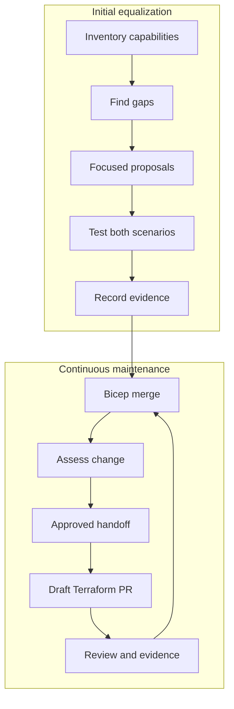
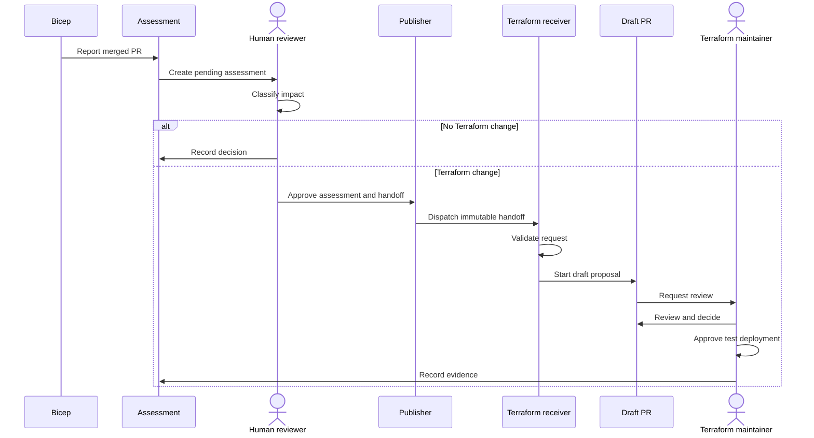

# Bicep and Terraform feature parity

The AI Landing Zone has two separate infrastructure-as-code implementations:

- [Bicep implementation](https://github.com/Azure/bicep-ptn-aiml-landing-zone)
- [Terraform implementation](https://github.com/Azure/terraform-azurerm-avm-ptn-aiml-landing-zone)

Both implementations describe the same AI Landing Zone, but they are maintained
in different repositories and can change at different times. The feature parity
initiative provides a reviewed process for finding differences, preparing
focused Terraform updates, and collecting evidence that both implementations
behave as expected.

## Key terms

| Term | Meaning |
| --- | --- |
| **Parity** | Bicep and Terraform support the same approved capability and observable behavior for a named deployment scenario. |
| **Parity assessment** | A reviewed decision about whether a merged Bicep change requires Terraform work. |
| **Handoff** | An approved, immutable record that tells the Terraform repository which behavior, constraints, scenarios, and checks are in scope. Immutable means the record is read from one specific commit and cannot be changed during delivery. |
| **Proposal PR** | A draft Terraform pull request created for maintainers to review. It is not an approval to merge, deploy, or release. |
| **Evidence** | Reviewed records that show what was compared, which checks passed, what was deployed, and how deployed behavior was verified. |

Parity requires more than creating the same Azure resources. The comparison
also covers parameters, default values, outputs, managed identities, networking,
runtime configuration, and deployed behavior. A matching resource list by
itself is not enough to establish parity.

## The two phases

### Phase 1: Initial feature equalization

The initial phase establishes a reviewed baseline:

1. Inventory the current capabilities in Bicep and Terraform.
2. Identify gaps for each supported scenario.
3. Create focused Terraform proposal PRs for approved gaps.
4. Review and merge each proposal through the Terraform repository's normal
   process.
5. Deploy both `standalone-standard` and
   `standalone-network-isolated` in approved test environments.
6. Record deployment and behavior evidence before claiming parity for a
   capability or scenario.

The two standalone scenarios are assessed separately. A successful deployment
of one scenario does not prove the other scenario.

### Phase 2: Continuous maintenance

After the baseline work, each relevant Bicep merge is handled as a smaller
change:

1. Create a pending parity assessment for the merged Bicep pull request.
2. Have a reviewer classify the impact and record the reason.
3. Require human approval before Terraform work can be requested.
4. Publish an immutable handoff for approved Terraform work.
5. Let the Terraform receiver validate the request and start one draft proposal
   PR for review.
6. Keep merge, deployment, evidence, and parity decisions under human control.

## Automation and human control

Automation reduces repeated record-keeping and validates that requests follow
the approved contract. It can:

- create a pending assessment after an eligible Bicep merge;
- validate records, commit references, approvals, and duplicate requests;
- publish an approved handoff to the Terraform repository; and
- start the process that produces one draft Terraform proposal PR.

Humans still decide:

- whether a Bicep change affects Terraform;
- whether an assessment and handoff are approved;
- whether publication is approved;
- whether a Terraform proposal is correct and should merge;
- whether and where test deployments may run; and
- whether the recorded evidence is sufficient for a parity decision.

The system never automatically:

- merges a pull request;
- deploys Azure resources;
- runs `terraform apply`;
- publishes a release;
- writes Terraform changes back into the Bicep implementation; or
- claims runtime parity.

A merged Terraform proposal completes implementation work only. Runtime parity
still requires approved deployment and comparison evidence for each applicable
scenario.

## Current status

As of August 2026, the parity framework and baseline capability inventory exist
in the Bicep repository. Initial draft Terraform proposals were created for
[networking](https://github.com/Azure/terraform-azurerm-avm-ptn-aiml-landing-zone/pull/162)
and
[application platform](https://github.com/Azure/terraform-azurerm-avm-ptn-aiml-landing-zone/pull/164),
and the
[Terraform receiver is also a draft proposal](https://github.com/Azure/terraform-azurerm-avm-ptn-aiml-landing-zone/pull/170).

These proposals and the receiver remain subject to repository review. Approved
test deployments and recorded behavior evidence are still required before any
runtime parity claim. This status does **not** claim that Bicep and Terraform
have completed parity.

## Authoritative records and process documents

This page is a public overview. It does not replace the administrative runbook
and does not contain operator credentials or secret values.

- [Bicep parity process guide](https://github.com/Azure/bicep-ptn-aiml-landing-zone/blob/main/docs/terraform-parity-process.md)
- [Ownership and operations runbook](https://github.com/Azure/bicep-ptn-aiml-landing-zone/blob/main/docs/terraform-parity-ownership.md)
- [Generated capability inventory](https://github.com/Azure/bicep-ptn-aiml-landing-zone/blob/main/docs/terraform-parity.md)

