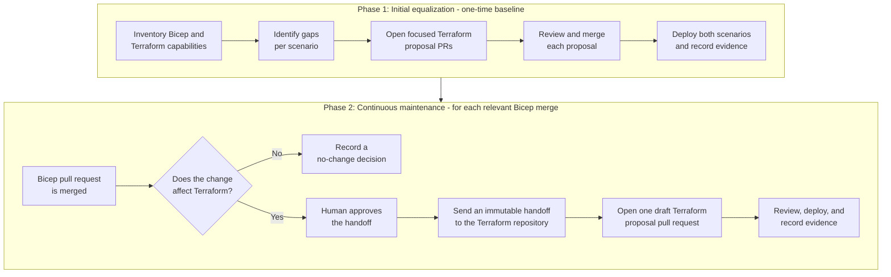
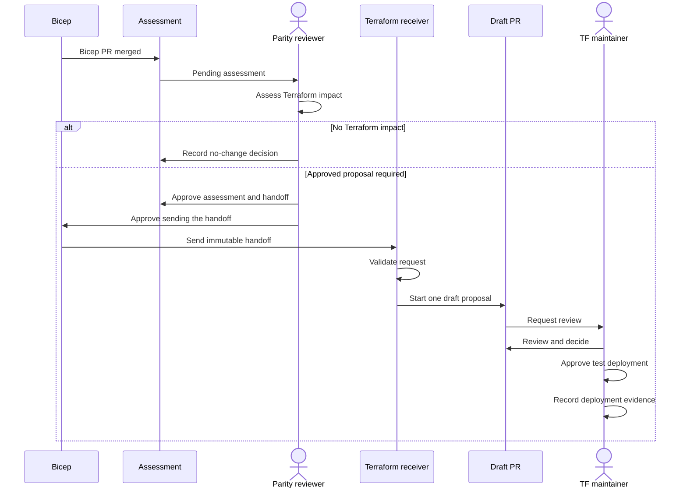

# Bicep and Terraform feature parity

The AI Landing Zone is a reusable set of files and guidance for deploying a
standard Azure environment for AI workloads. It can be deployed with
**infrastructure as code**, which means text files describe the Azure resources
and settings so that a deployment can be reviewed and repeated.

**Bicep** and **Terraform** are two infrastructure-as-code languages. Bicep is
designed for Azure deployments. Terraform can deploy Azure resources through
its Azure integration and uses its own configuration format and tools.

The AI Landing Zone has one implementation in each language:

- [Bicep implementation](https://github.com/Azure/bicep-ptn-aiml-landing-zone)
- [Terraform implementation](https://github.com/Azure/terraform-azurerm-avm-ptn-aiml-landing-zone)

They live in separate repositories because each language has its own files,
modules, tests, review process, and release process. The repositories can change
at different times, so a capability may be added to one implementation before
the other or may behave differently.

**Equivalent behavior** means that, for the same supported deployment scenario,
both implementations provide the same intended capabilities, access controls,
network behavior, settings and values that users and applications depend on,
and working deployed result. It does not mean that the Bicep and Terraform
source code must look the same.

The feature parity initiative detects and manages differences through human
review, focused Terraform updates, and recorded deployment evidence.

## Deployment scenarios used for comparison

A **deployment scenario** is an approved combination of options that is tested
as one case. The current parity work assesses two scenarios:

- **`standalone-standard`** is the standard standalone deployment.
- **`standalone-network-isolated`** is the standalone deployment with network
  isolation and private connectivity.

The scenarios are assessed independently because network isolation changes how
services connect, resolve names, route traffic, and enforce access. A successful
standard deployment does not prove that private connectivity works, and a
successful network-isolated deployment does not replace testing the standard
deployment.

## Key terms

| Term | Meaning |
| --- | --- |
| **Capability** | A feature the deployment supports, such as using an existing Azure resource or using private connectivity. |
| **Parity** | Bicep and Terraform support the same approved capability and observable behavior for a named deployment scenario. |
| **Parity assessment** | A reviewed decision about whether a merged Bicep change requires Terraform work. |
| **Handoff** | An approved, immutable record that tells the Terraform repository which behavior, constraints, scenarios, and checks are in scope. Immutable means the record is read from one specific commit and cannot be changed during delivery. |
| **Proposal pull request (PR)** | A draft Terraform change created for maintainers to review. It is not an approval to merge, deploy, or release. |
| **Terraform request receiver** | A workflow in the Terraform repository that validates an approved handoff and starts the process for one draft proposal pull request. |
| **Evidence** | Reviewed records that show what was compared, which checks passed, what was deployed, and how deployed behavior was verified. |

## What is compared

A matching list of Azure resources is not enough to establish parity. The
comparison also covers:

- **Parameters and defaults:** the choices users can provide and the values used
  when they do not provide a choice.
- **Outputs:** the information returned after deployment for people, scripts,
  and other systems to use.
- **Identity and role-based access control (RBAC):** the managed identities and
  permissions used by services and people.
- **Networking:** public or private access, private endpoints, name resolution,
  and traffic routing.
- **Runtime configuration:** the settings that deployed services and
  applications use while running.
- **Deployed behavior:** what actually works after the resources are created,
  not only whether the source files pass static checks.

## The two phases

### Phase 1: Initial feature equalization

The initial phase establishes a reviewed baseline:

1. Inventory the current capabilities in Bicep and Terraform.
2. Identify gaps separately for `standalone-standard` and
   `standalone-network-isolated`.
3. Open focused Terraform proposal pull requests for approved gaps.
4. Have Terraform maintainers review each proposal and decide whether to merge
   it.
5. Deploy both scenarios in approved test environments.
6. Record deployment and behavior evidence before claiming parity for any
   capability or scenario.

### Phase 2: Continuous maintenance

After the baseline work, each relevant Bicep merge is handled as a smaller
change:

1. Create a pending parity assessment for the merged Bicep pull request.
2. Have a human reviewer decide whether the change affects Terraform and record
   the reason.
3. If it does not affect Terraform, record the no-change decision and stop. No
   handoff or Terraform proposal is created.
4. If Terraform work is required, classify it as `proposal-required` and require
   human approval of the assessment and handoff.
5. Send the approved, immutable handoff to the Terraform repository.
6. Have the Terraform request receiver validate the handoff and start one draft
   proposal pull request for review.
7. Keep merge, deployment, evidence, and parity decisions under human control.

Not every Bicep merge produces Terraform work. Only an approved
`proposal-required` assessment can create a handoff and start a Terraform
proposal.

## Automation and human control

Automation reduces repeated record-keeping and validates that requests follow
the approved contract. It can:

- create a pending assessment after an eligible Bicep merge;
- validate records, commit references, approvals, and duplicate requests;
- send a handoff only after the required human approvals; and
- validate the handoff in the Terraform repository and start the process that
  produces one draft Terraform proposal pull request.

Humans still decide:

- whether a Bicep change affects Terraform;
- whether an assessment and handoff are approved;
- whether sending the handoff is approved;
- whether a Terraform proposal is correct and should merge;
- whether and where test deployments may run; and
- whether the recorded evidence is sufficient for a parity decision.

The system never automatically:

- merges a pull request;
- deploys Azure resources;
- runs `terraform apply`;
- publishes a release;
- writes Terraform changes back into the Bicep implementation; or
- claims runtime parity.

A merged Terraform proposal completes implementation work only. Runtime parity
still requires approved deployment and comparison evidence for each applicable
scenario.

## Current status

As of August 2026, the parity framework and baseline capability inventory exist
in the Bicep repository. Initial draft Terraform proposals were created for
[networking](https://github.com/Azure/terraform-azurerm-avm-ptn-aiml-landing-zone/pull/162)
and
[application platform](https://github.com/Azure/terraform-azurerm-avm-ptn-aiml-landing-zone/pull/164),
and the
[Terraform request receiver is also a draft proposal](https://github.com/Azure/terraform-azurerm-avm-ptn-aiml-landing-zone/pull/170).

These proposals and the receiver remain subject to repository review. Approved
test deployments and recorded behavior evidence are still required before any
runtime parity claim. This status does **not** claim that Bicep and Terraform
have completed parity.

## Authoritative records and process documents

This page is a public overview. It does not replace the administrative runbook
and does not contain operator credentials or secret values.

- [Bicep parity process guide](https://github.com/Azure/bicep-ptn-aiml-landing-zone/blob/main/docs/terraform-parity-process.md)
- [Ownership and operations runbook](https://github.com/Azure/bicep-ptn-aiml-landing-zone/blob/main/docs/terraform-parity-ownership.md)
- [Generated capability inventory](https://github.com/Azure/bicep-ptn-aiml-landing-zone/blob/main/docs/terraform-parity.md)
